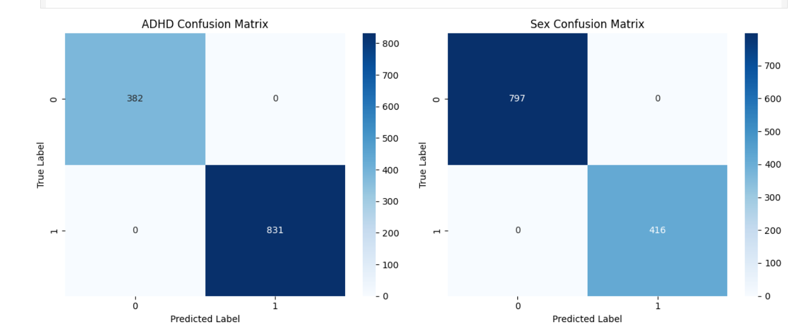

# WiDS_2025
# GitHub Kaggle Project README
# WiDS_Team_Dendrites
---

### **👥 Team Members**

| Name | GitHub Handle | Contribution |
| ----- | ----- | ----- |
| Ruth Velasquez | [@Abillama05](https://github.com/abillama05) | Built CNN model, performed data cleaning, minor feature engineering |
| Frantzia Theodat | @FranTheo | Exploratory data analysis | 
| Marzana Afroz | @marzanaafroz | Explored and interpreted the data to guide model selection; researched multi-output TensorFlow CNN approaches |
| Christiana Nardi | [@cbekk](https://github.com/cbekk) | Built multi-output regression model, performed data cleaning and analysis, and parameter tuning |

---

## **🎯 Project Highlights**

* Built a PyTorch Convoluted Nueral Network using an Multi Output Model to solve a binary classification of fMRI FCM, categorical, and quantitative data.
* Achieved an F1 score of \[insert score\] and a ranking of \[insert ranking out of participating teams\] on the final Kaggle Leaderboard
* Used \[explainability tool\] to interpret model decisions
* Implemented \[data preprocessing method\] to optimize results within compute constraints

🔗 [WiDS Datathon 2025 | Kaggle Competition Page](https://www.kaggle.com/competitions/widsdatathon2025/overview)

---

## **👩🏽‍💻 Setup & Execution**

**Provide step-by-step instructions so someone else can run your code and reproduce your results. Depending on your setup, include:**

* How to clone the repository
  ```
  bash
  git clone https://github.com/VIR-WiDS-Team-Dendrites/WiDS_2025.git
  cd WiDS_2025
* How to install dependencies:
  ```
  pip install pandas numpy scikit-learn matplotlib seaborn torch
* How to set up the environment
  ```
  python -m venv venv
  source venv/bin/activate  # On macOS/Linux
  venv\Scripts\activate  # On Windows
* How to access the dataset
  download from competition page: [WiDS Datathon 2025 | Kaggle Competition Page](https://www.kaggle.com/competitions/widsdatathon2025/overview)
* How to run the notebook:
**Shift + Enter**
---

## **🏗️ Project Overview**

This project was developed for the WiDS Datathon 2025, hosted on Kaggle and supported by the Break Through Tech AI Program. Our team, WiDS_Team_Dendrites, collaborated to tackle the challenge of predicting ADHD diagnoses using a combination of functional MRI-derived Functional Connectome Matrices (FCMs) and accompanying categorical and quantitative features.

The dataset required extensive exploration to understand brain connectivity patterns and their relationship to ADHD. FCMs, which represent the functional connectivity between different brain regions, had to be normalized and resized for modeling—particularly when working with deep learning models like CNNs.

Our initial focus was on understanding the dataset structure, identifying preprocessing requirements, and researching suitable multi-output model architectures. We explored various modeling strategies—including TensorFlow-based CNNs and PyTorch multi-output models—to handle the multi-label classification task efficiently within compute constraints.

This work not only enhanced our technical understanding of neuroimaging and deep learning but also holds real-world significance by contributing to research in ADHD diagnosis and mental health analytics through AI-driven approaches.

---

## **📊 Data Exploration**

**Describe:**

* The datasets used were from the WiDS 2025 Kaggle competition.
* Data exploration and preprocessing approaches
  
      1. Fill Null values with a range of random values between the mean and standard deviation.
      2. Fill Null values in test data with -1 since creating a new value could mess with predictions
      3. Remove highly correlated features
      4. Convert fMRI FCM into graph objects
* Challenges and assumptions when working with the dataset(s)
  
      1. Working with fMRI as Functional Connectome Matrices was new for us
      2. Assumed at first that the training solutions would have no null values but there were a few instances which affected out first model's accuracy


### Data Preprocessing Visualizations: 
<table>
  <tr>
    <th>"Track_Age_At_Scan" before imputation</th>
    <th>"Track_Age_At_Scan" after imputation</th>
  </tr>
  <tr>
    <td></td>
    <td></td>
  </tr>
  <tr>
    <th>Correlation Matrix to find most correlated features</th>
  </tr>
  <tr>
    <td></td>
  </tr>
</table>

---

## **🧠 Model Development**

**Describe (as applicable):**

* Model used: We used a multi-output feed-forward neural network using PyTorch.
* Feature selection and Hyperparameter tuning strategies: A correlation matrix was created for the dataset, and highly correlated features were identified and dropped (SDQ_SDQ_Hyperactivity).
Missing values were handled by adding a default float value for the categorical variables and filling the missing MRI age values with random samples drawn from a normal distribution based on the mean and standard deviation. The network works with one hidden layer of 128 units in the shared branch and 64 units in each output branch. It also is set up at a learning rate of 0.001, batch size of 32, and training for 50 epochs.
* Training setup: The model’s performance is evaluated using accuracy, confusion matrices, and classification reports (precision, recall, f1-score). 

---

## **📈 Results & Key Findings**

**Describe (as applicable):**

* Performance metrics (e.g., Kaggle Leaderboard score, F1-score): On the Kaggle leaderboard, the model performed at 76.319% accuracy.
* How your model performed overall: The model demonstrated good performance on the training set with both outputs (ADHD and Sex predictions).
* How your model performed across different skin tones (AJL) N/A
* Insights from evaluating model fairness (AJL) N/A

**Visualizations:**
 <td>

---

## **🖼️ Impact Narrative**

**WiDS challenge:**

1. What brain activity patterns are associated with ADHD; are they different between males and females, and, if so, how?
2. How could your work help contribute to ADHD research and/or clinical care?

---

## **🚀 Next Steps & Future Improvements**

**Address the following:**

* What are some of the limitations of your model?
  One limitation of our current model was its ability to generalize across unseen data. While it did perform well on the training set and validation data, its   performance may degrade when exposed to more new data. This could be due to the model's reliance on specific patterns present in the training data that   
  might not be applicable elsewhere.
* What would you do differently with more time/resources?
  If we had more time and resources, we might explore other algorithms, such as gradient boosting or support vector machines. We might also try experimenting different models and see if they work better with this task.
* What additional datasets or techniques would you explore? To further improve the model's performance, we could explore external datasets to enhance the diversity of our data and our model's ability to generalize well.

---

## **📄 References & Additional Resources**

Pandas: McKinney, W. (2010). Data Structures for Statistical Computing in Python. Proceedings of the 9th Python in Science Conference. Retrieved from https://pandas.pydata.org/

NumPy: Harris, C. R., et al. (2020). Array programming with NumPy. Nature, 585, 357–362. Retrieved from https://numpy.org/

Matplotlib: Hunter, J. D. (2007). Matplotlib: A 2D Graphics Environment. Computing in Science & Engineering, 9(3), 90-95. Retrieved from https://matplotlib.org/

Seaborn: Waskom, M. (2021). Seaborn: Statistical Data Visualization. Journal of Open Source Software, 6(60), 3021. Retrieved from https://seaborn.pydata.org/

Scikit-learn: Pedregosa, F., et al. (2011). Scikit-learn: Machine Learning in Python. Journal of Machine Learning Research, 12, 2825-2830. Retrieved from https://scikit-learn.org/

PyTorch: Paszke, A., et al. (2019). PyTorch: An Imperative Style, High-Performance Deep Learning Library. Advances in Neural Information Processing Systems (NeurIPS). Retrieved from https://pytorch.org/

WiDS Datathon (2025). Title of dataset. Retrieved from https://www.kaggle.com/competitions/widsdatathon2025/data

K-Nearest Neighbors Imputer (KNNImputer) and Principal Component Analysis (PCA) are both provided as part of the scikit-learn library. 


---

